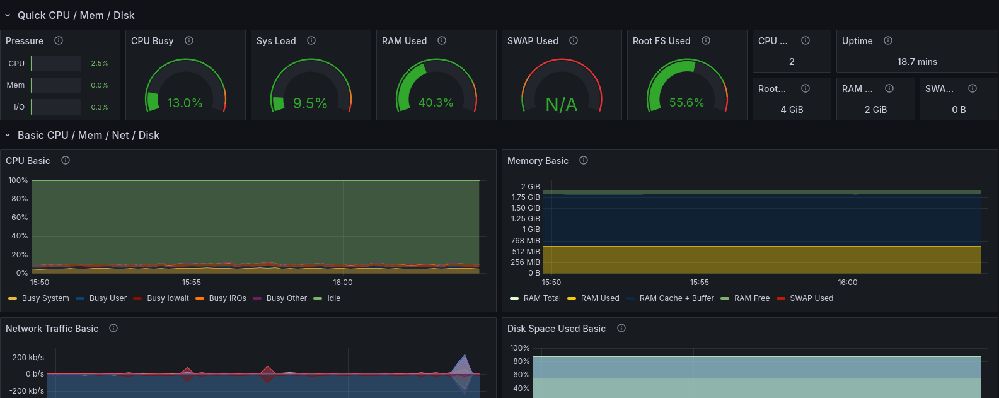

<h1 align="center">
    k3s-nix
</h1>

<p align="center">
  </a>
</p>

<p align="center">
  <a href="https://k3s.io/"></a>
  <a href="https://nixos.org/"></a>
</p>

<p align="center">
  Reproducible <a href="https://k3s.io">k3s</a> clusters and deployments in pure Nix.
</p>

## Overview

This is an example repository that shows how to set up a lightweight k3s cluster together with
Kubernetes resources in pure Nix. It provides configurations to run a
[Node exporter](https://github.com/prometheus/node_exporter) DaemonSet, a
[Prometheus](https://prometheus.io/) Deployment, a [Grafana](https://grafana.com/) Deployment and a
[nginx](https://nginx.org/en/) Helm chart in a cluster with two nodes ([server](./server.nix) &
[agent](./agent.nix)). It also deploys secrets via [sops-nix](https://github.com/Mic92/sops-nix).

```bash
$ kubectl get nodes -owide
NAME     STATUS   ROLES                  AGE    VERSION        INTERNAL-IP   EXTERNAL-IP   OS-IMAGE                KERNEL-VERSION   CONTAINER-RUNTIME
agent    Ready    <none>                 130m   v1.32.1+k3s1   192.168.1.1   <none>        NixOS 25.05 (Warbler)   6.12.16          containerd://1.7.23-k3s2
server   Ready    control-plane,master   129m   v1.32.1+k3s1   192.168.1.2   <none>        NixOS 25.05 (Warbler)   6.12.16          containerd://1.7.23-k3s2
```

K3s offers several useful features that enable the management of Kubernetes resources directly
through the filesystem. Additionally, the NixOS k3s module provides convenient options to integrate
these features into your NixOS configuration. For instance, the
[`services.k3s.manifests`](https://search.nixos.org/options?channel=unstable&show=services.k3s.manifests&from=0&size=50&sort=relevance&type=packages&query=k3s)
option lets you configure
[auto-deploying manifests (AddOns)](https://docs.k3s.io/installation/packaged-components#auto-deploying-manifests-addons),
while the the
[`services.k3s.images`](https://search.nixos.org/options?channel=unstable&show=services.k3s.images&from=0&size=50&sort=relevance&type=packages&query=k3s)
option lets you specify container images that k3s imports at startup. Check out
[all k3s options](https://search.nixos.org/options?channel=unstable&from=0&size=50&sort=relevance&type=packages&query=k3s)
for more information.

This setup makes it easy to manage both infrastructure and deployments from a single repository with
a single command, making it an excellent choice for home labs, air-gapped environments, CI/CD
pipelines, and more.

#### :floppy_disk: Self-contained

Clusters built in this way come fully equipped with everything they need, eliminating the need to
download anything at runtime. This makes it possible to run clusters in air-gapped environments or
in NixOS VM tests. However, this approach is optional—you can also choose to omit container images
from the configuration and let the nodes download them as needed during runtime.

#### :arrows_counterclockwise: Reproducible

The cluster and deployments are fully reproducible, particularly when the container images are
included in the build. If it works in your tests, you can be confident it will run seamlessly in
production as well.

#### :cloud: Lightweight

K3s is lightweight Kubernetes. Half the memory than regular Kubernetes in a binary less than 100 MB.

#### :lock: Immutable

The Kubernetes API server can be locked down, as there is no need for runtime modifications to the
cluster.

## Test it

This flake provides an [auto deploy test](./tests/auto-deploy.nix) that starts the cluster and
checks that the deployments are healthy. You can also use an interactive test driver that lets you
explore the cluster. Build it with `nix build .#checks.x86_64-linux.autoDeploy.driverInteractive`
and run `./result/bin/nixos-test-driver`. Start the nodes by running `start_all()` inside the python
repl. This spins up two virtual machines, a server node and an agent node, and forwards some ports
to your host (see [./tests/interactive.nix](./tests/interactive.nix)) so you can interact with the
test nodes. Run `ssh root@localhost -p 20022` to access the server node (use port `10022` for the
agent) and run `kubectl` commands. Depending on your hardware, everything is up and running after
approximately 2 minutes.

```bash
$ kubectl get pods
NAME                             READY   STATUS      RESTARTS   AGE
grafana-65bdd57cc7-nlkj2         1/1     Running     0          115s
hello-world-85544cf5fd-mj292     1/1     Running     0          46s
node-exporter-7x9m8              1/1     Running     0          78s
node-exporter-xsm2d              1/1     Running     0          112s
prometheus-67dcbf6f46-g47gf      1/1     Running     0          115s
```

The testing driver also forwards ports `80` and `443` to `20080` and `20443` respectively. Visit the
Grafana deployment at <http://localhost:20080/grafana> (username `admin`, password `k3snix`) and
nginx at <http://localhost:20080/hello>. Grafana is provisioned with two dashboards, Kubernetes API
server and Node Exporter Full.



Alternatively, build qcow2 images with `nix build .#server` and `nix build .#agent` and run them
with a tool of your choice. You can also install the configurations on real hardware. Set
`services.k3s.serverAddr` in [agent.nix](./agent.nix) to the server IP when running outside the
NixOS test.

### External access

> [!CAUTION]
> Make sure to not overwrite an existing kubeconfig that you still need.

You can get a kubeconfig and use it to access the cluster externally. Copy the kubeconfig with
`scp -P 20022 root@localhost:/etc/rancher/k3s/k3s.yaml ~/.kube/config` and modify the server port
with `sed -i 's/:6443/:26443/' ~/.kube/config`.

## Deploy secrets

> [!IMPORTANT]
> The keys to decrypt [secrets.yaml](./secrets.yaml) are placed in the [keys](./keys/) directory. In
> a normal setup you should keep the keys always secret!

This uses [sops-nix](https://github.com/Mic92/sops-nix) and its
[templates](https://github.com/Mic92/sops-nix?tab=readme-ov-file#templates) feature to deploy
secrets. The idea is to create templates of Kubernetes secret resources and let sops-nix substitute
placeholders with the actual secrets at activation time. For an example of how this is implemented,
see [./modules/secrets.nix](./modules/secrets.nix). This approach also works with other secret
provisioning tools that support templating and custom paths.

In order to decrypt and change the secrets run `nix develop`, this will set `SOPS_AGE_KEY_FILE` and
make [sops](https://github.com/getsops/sops) available. Consequently run `sops edit secrets.yaml` to
change the secrets.

## Install Helm charts

Install Helm charts via the
[k3s Helm controller](https://docs.k3s.io/helm?_highlight=helm#using-the-helm-controller). See
[./modules/helm-hello-world.nix](./modules/helm-hello-world.nix) for an example. However, after
using k3s a while with Nix I definitely prefer writing NixOS modules for deployments instead of
using Helm charts.
