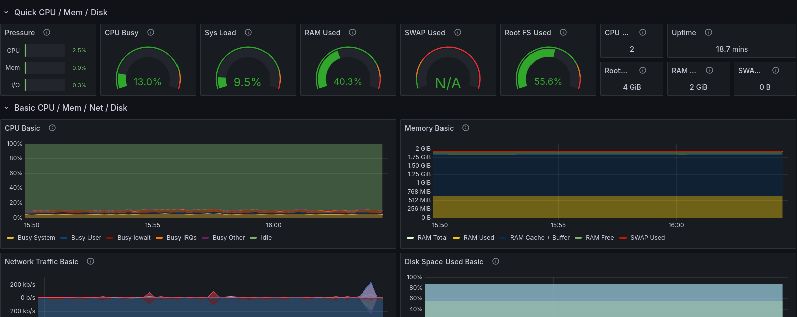

<h1 align="center">
    k3s-nix
</h1>

<p align="center">
  </a>
</p>

<p align="center">
  <a href="https://k3s.io/"></a>
  <a href="https://nixos.org/"></a>
</p>

<p align="center">
  Reproducible <a href="https://k3s.io">k3s</a> clusters and deployments in pure Nix.
</p>

## Overview

This repository shows how to set up a lightweight k3s cluster together with Kubernetes resources in
pure Nix. Manage infrastructure and deployments from a single repository with a single command.
Great fit for home labs, air-gapped environments, CI/CD pipelines, production, and more.

```bash
$ kubectl get nodes -owide
NAME     STATUS   ROLES                  AGE    VERSION        INTERNAL-IP   EXTERNAL-IP   OS-IMAGE                KERNEL-VERSION   CONTAINER-RUNTIME
agent    Ready    <none>                 130m   v1.32.1+k3s1   192.168.1.1   <none>        NixOS 25.05 (Warbler)   6.12.16          containerd://1.7.23-k3s2
server   Ready    control-plane,master   129m   v1.32.1+k3s1   192.168.1.2   <none>        NixOS 25.05 (Warbler)   6.12.16          containerd://1.7.23-k3s2
```

This repository should be considered an example that shows how everything fits together. It provides
a configuration that deploys a [Node exporter](https://github.com/prometheus/node_exporter)
DaemonSet, a [Prometheus](https://prometheus.io/) Deployment, a [Grafana](https://grafana.com/)
Deployment and a simple [nginx](https://nginx.org/en/) Helm chart. Additionally, it deploys secrets
via [sops-nix](https://github.com/Mic92/sops-nix).

### Features

#### :floppy_disk: Self-contained

Systems built this way have everything required. The cluster doesn't need to download anything at
runtime, making it possible to operate clusters in air-gapped environments or in hermetic CI/CD
pipelines. This also allows it to run k3s clusters in NixOS VM tests. Note that this is optional,
you can also omit container images in the configuration and expect the cluster to download them at
runtime.

#### :arrows_counterclockwise: Reproducible

By using Nix and not relying on downloading things at runtime, the built clusters are reproducible.
If they run in your tests, they will also run in production.

#### :cloud: Lightweight

K3s is lightweight Kubernetes. Half the memory than regular Kubernetes in a binary less than 100 MB.

#### :lock: Immutable

Just close the API server port (`6443`) in your firewall, if you want an immutable cluster. Nobody
will be able to modify your cluster, so you can be sure that there are only running the things
specified in the configuration.

## How it works

K3s has some nice features that allow to configure Kubernetes resources directly via the filesystem
and the NixOS k3s module provides options to use them in your NixOS configuration. For instance, the
[`services.k3s.manifests`](https://search.nixos.org/options?channel=unstable&show=services.k3s.manifests&from=0&size=50&sort=relevance&type=packages&query=k3s)
option lets you configure
[auto-deploying manifests (AddOns)](https://docs.k3s.io/installation/packaged-components#auto-deploying-manifests-addons),
the
[`services.k3s.images`](https://search.nixos.org/options?channel=unstable&show=services.k3s.images&from=0&size=50&sort=relevance&type=packages&query=k3s)
option lets you specify container images that k3s imports at startup, and so on. Check out
[all k3s options](https://search.nixos.org/options?channel=unstable&from=0&size=50&sort=relevance&type=packages&query=k3s)
for more information.

## Try it yourself

The easiest way to try it out is in a NixOS VM test. Build the test driver with
`nix build .#checks.x86_64-linux.autoDeploy.driverInteractive` and run it with
`./result/bin/nixos-test-driver`. Start the nodes by running `start_all()` inside the python repl.
This spins up two virtual machines, a server node and an agent node, and forwards some ports to your
host (see [./tests/interactive.nix](./tests/interactive.nix)) so you can interact with the test
nodes. Run `ssh root@localhost -p 20022` to access the server node (use port `10022` for the agent)
and run `kubectl` commands to to explore the cluster. Depending on your hardware, everything is up
and running after approximately 2 minutes (Grafana takes a while to get ready...).

```bash
$ kubectl get pods
NAME                             READY   STATUS      RESTARTS   AGE
grafana-65bdd57cc7-nlkj2         1/1     Running     0          115s
hello-world-85544cf5fd-mj292     1/1     Running     0          46s
helm-install-hello-world-pv825   0/1     Completed   0          115s
node-exporter-7x9m8              1/1     Running     0          78s
node-exporter-xsm2d              1/1     Running     0          112s
prometheus-67dcbf6f46-g47gf      1/1     Running     0          115s
```

The testing driver also forwards ports `80` and `443` to `20080` and `20443` respectively. Visit the
Grafana deployment at <http://localhost:20080/grafana> (username `admin`, password `secret`) and the
simple nginx at <http://localhost:20080/hello>. Grafana is provisioned with two dashboards,
Kubernetes API server and Node Exporter Full.



### External access

> [!CAUTION]
> Make sure to not overwrite an existing kubeconfig that you still need.

Like with any other cluster, you can get a kubeconfig and use it to access the cluster externally.
Copy the kubeconfig with `scp -P 20022 root@localhost:/etc/rancher/k3s/k3s.yaml ~/.kube/config` and
modify the server port `sed -i 's/:6443/:26443/' ~/.kube/config`.

## Deploy secrets

This uses [sops-nix](https://github.com/Mic92/sops-nix) and its really useful
[templates](https://github.com/Mic92/sops-nix?tab=readme-ov-file#templates) feature to place
securely deploy secrets. The idea is to create templates of Kubernetes secret resources and let
sops-nix substitute placeholders with the actual secrets at activation time. This approach also
works with any other secret provisioning tool that allows templating and custom paths. See
[./modules/secrets.nix](./modules/secrets.nix) for further information.

## Install Helm charts

This approach isn't limited to plain manifest files, you can install Helm charts via the
[k3s Helm controller](https://docs.k3s.io/helm?_highlight=helm#using-the-helm-controller). See
[./modules/helm-hello-world.nix](./modules/helm-hello-world.nix) for an example. However, after
working a while with k3s and Nix I definitely prefer writing NixOS modules for my deployments
instead of using Helm charts.
